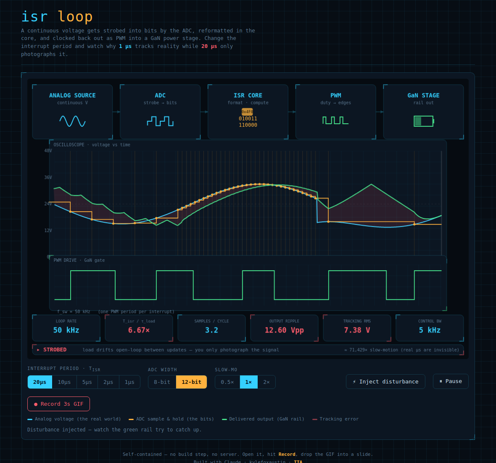

# ISR Loop Visualizer

An interactive, single-file explainer for the classic embedded control loop:

> **continuous voltage → ADC samples it into bits → core reformats / computes → PWM clocks it back out → GaN power stage drives a rail**

Built to make one point land for a non-specialist: *the interrupt period isn't a knob you turn for "speed" — it decides whether your output tracks reality or just photographs it.* Slide the ISR period from **20 µs** down to **1 µs** and watch the sample-and-hold staircase tighten onto the curve, the output ripple collapse, and the verdict flip from **STROBED** to **REAL-TIME**.



## What it shows

- **Pipeline band** — the five stages with live readouts: the analog source, the ADC strobe, the core's binary word, the PWM duty, and the GaN stage feeding a little battery that **heats up and changes color** (green→amber→red, with a temperature) as the loop rate punishes it. Bit packets flow ADC → core → PWM at the real tick rate.
- **Oscilloscope** — the true analog voltage (cyan), the ADC sample-and-hold staircase + strobe lines (amber), and the delivered rail. The rail is a **bold smooth line inside a translucent switching-ripple band**, and both are colored by *freshness*: **green** where a fresh ISR update just landed, **red** where the rail is coasting on held/stale data. Tracking error is shaded faint red.
- **PWM drive** — the gate waveform. Two carrier modes: **Per-ISR** (one PWM period per interrupt) or a fixed **1 MHz** carrier where periods that merely replay the held command are drawn **red** and the one fresh period after each ISR update stays **green** — so you can literally count how much of the output is stale.
- **Metrics + verdict** — loop rate, `T_isr / τ_load` ratio, samples per signal cycle, ADC LSB (quantization step), output ripple, tracking RMS error, control bandwidth, **ripple current** into the pack, **battery aging rate**, **cumulative wasted heat**, and a plain-English verdict.
- **Battery + safety band** — the scope draws the safe operating-voltage window (`SAFE MAX` / `SAFE MIN`); when a strobed loop's ripple punches past it, the line flashes red and the overshoot is shaded — **⚠ OVERVOLTAGE — ripple cooks the pack**. See ["What the loop rate does to the battery"](#what-the-loop-rate-does-to-the-battery) below.
- **Disturbance verdict** — hit **⚡ Inject disturbance** and the scope marks the glitch, shades the **blind window** (glitch → next ADC sample), and renders a **CAUGHT / PARTIAL / MISSED** verdict with the % of the spike that survived to the first sample. At 1 µs the loop catches ~99 %; at 20 µs it's usually blind long enough that most of the spike has decayed unseen.

## Controls

- **Interrupt period `T_isr`** — 20 / 10 / 5 / 2 / 1 µs. The one knob that matters.
- **ADC width** — 8 / 12 / **18**-bit. Changes the quantization step shown in the **ADC LSB** metric (188 mV → 11.7 mV → 0.18 mV) and widens the binary word + packet hex. Note: on a 48 V / 250 px scope even 8-bit is only ~1 px of stair-stepping, so the *waveform* barely moves — in this loop the **temporal** sample-and-hold dominates, not amplitude quantization. The metric is where the bit depth actually shows.
- **PWM carrier** — Per-ISR or fixed 1 MHz (drives the red/green stale-vs-fresh story in both the PWM strip and the scope rail).
- **ISR overrun** — Off / On. When on, the ISR is given a realistic execution time (`base + jitter`, plus extra while handling a disturbance). If that exceeds `T_isr`, the deadline is **blown**: the due update is *dropped* (the PWM holds, no fresh push) and the period is drawn **hatched magenta** — distinct from stale-red. Fast loops have little margin (1 µs blows occasionally even idle, ~30 % during a glitch); slow loops never overrun. This is the difference between *stale data* (you chose to update slowly) and a *missed deadline* (you tried and ran out of time).
- **Slow-mo** — 0.5× / 1× / 2× virtual-time rate.
- **⚡ Inject disturbance**, **⏸ Pause**, **● Record 3s GIF**.

## Why 1 µs ≫ 5 µs

The load (LC filter + battery) has a **fixed physical time constant** `τ_load ≈ 3 µs`. Everything keys off the ratio `r = T_isr / τ_load`:

| T_isr | r = T_isr/τ | Output ripple | Verdict |
|------:|:-----------:|:-------------:|:--------|
| 20 µs | 6.7× | ~12.6 Vpp | STROBED |
| 5 µs  | 1.7× | ~2.5 Vpp  | STROBED (marginal) |
| 2 µs  | 0.67× | ~0.4 Vpp | MARGINAL |
| 1 µs  | 0.33× | ~0.1 Vpp | REAL-TIME |

At **5 µs** the loop period is *longer* than the load can hold steady, so the rail drifts open-loop between updates — ripple scales with `(T_isr/τ)²`. At **1 µs** you're correcting ~3× per load time-constant, so the rail is glued to the command. That's the whole "buy GaN, switch faster, shrink the passives, close the loop cycle-by-cycle" argument in one picture.

> The numbers are a teaching model, not a SPICE deck. `(T_isr/τ)²` ripple scaling is the right *shape* (buck ripple ∝ 1/f_sw²); absolute values are tuned for legibility.

## What the loop rate does to the battery

The same ripple that makes the rail "STROBED" is what punishes the pack — and it's brutally nonlinear:

1. **Ripple → ripple current.** The AC ripple drives a current through the pack's internal resistance: `I_rip ≈ V_ripple / Z`.
2. **Ripple current → heat.** `P_loss = I_rip²·ESR` — pure I²R waste dumped *inside* the cell. Since ripple ∝ `(T_isr/τ)²`, the heating scales like **`(T_isr/τ)⁴`**.
3. **Heat → aging.** Every ~+10 °C roughly **halves** cycle life (Arrhenius).

So at the same average power:

| T_isr | ripple current | cell temp | aging |
|------:|:--------------:|:---------:|:-----:|
| 20 µs | ~9 A | ~66 °C 🔥 | ~16× faster |
| 5 µs  | ~1.8 A | ~27 °C | ~1.1× |
| 1 µs  | ~0.1 A | ~25 °C ❄ | 1× |

A slow loop doesn't just track poorly — it **cooks the battery and overshoots the safe-voltage window**. A fast loop keeps the pack cool, efficient, and inside its limits. That's the "switch faster, close the loop cycle-by-cycle" argument extended all the way to pack life. (Battery constants — ESR, thermal resistance, safe window — are teaching values in `cfg`.)

The cell has **thermal mass**: temperature eases toward its steady-state target on a time constant (~4 s in the model), so it *heats up* gradually at 20 µs and *cools back down* gradually when you drop to 1 µs — the ripple current changes instantly, the temperature lags. A **cumulative wasted-heat counter** (`WASTED HEAT`, in J/kJ) tallies the I²·ESR energy dumped into the pack; it races up at 20 µs and all but freezes at 1 µs, so running hot for a while then going fast shows exactly how much energy the slow loop already threw away.

## Recording a GIF for slides

Hit **● Record 3s GIF**. It captures the diagram canvas (15 fps, 3 s) and downloads `isr-loop-<period>us.gif` — drop it straight into PowerPoint. `gif.js` is vendored locally (`vendor/gif.js`) and the worker is inlined, so recording works even when you just double-click `index.html` — no server, no CDN.

## Running it

Just open `index.html`. No build, no dependencies, no network needed. Keep the `vendor/` folder next to it.

For a quick local server if you prefer one:
```bash
python3 -m http.server 8000   # then visit http://localhost:8000
```

## License

MIT — see `LICENSE`.

TTA
